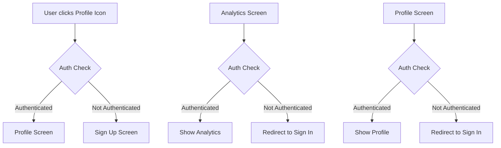

# Authentication System Implementation Plan

## Overview
Implement authentication-based navigation where clicking the profile icon checks authentication status and navigates to either Profile (if authenticated) or Sign Up (if not authenticated). Analytics and Profile screens require authentication.

## Architecture

### Components
1. **Authentication Context** - Manages auth state with persistence
2. **Sign Up Screen** - Email, name, password registration
3. **Sign In Screen** - Email, password login
4. **Protected Screens** - Profile and Analytics with auth guards
5. **Navigation Updates** - Tab layout and header icon behavior

### Authentication Flow


## Implementation Details

### 1. Authentication Context (`contexts/AuthContext.tsx`)
- Manage user authentication state
- Persist auth data using AsyncStorage
- Provide login/logout/signup functions
- Mock authentication with future API integration

### 2. New Screens
- `app/signup.tsx` - Registration form
- `app/signin.tsx` - Login form

### 3. Protected Route Guards
- Wrap Profile and Analytics screens with auth checks
- Redirect to Sign In if not authenticated

### 4. Navigation Updates
- Update tab layout to handle auth state
- Modify profile icon in Home screen header
- Add navigation between auth screens and tabs

## File Structure Changes
```
app/
├── _layout.tsx (updated)
├── modal.tsx
├── signup.tsx (new)
├── signin.tsx (new)
└── (tabs)/
    ├── _layout.tsx (updated)
    ├── index.tsx (updated)
    ├── analytics.tsx (updated)
    ├── profile.tsx (updated)
    └── settings.tsx

contexts/
├── AuthContext.tsx (new)
├── BleContext.tsx
└── HealthDataContext.tsx
```

## Technical Specifications

### Authentication Context Features
- User state management
- AsyncStorage persistence
- Login/logout/signup functions
- Loading states
- Error handling

### Form Validation
- Email format validation
- Password strength requirements
- Required field validation

### Navigation
- Stack navigation for auth screens
- Tab navigation for main app
- Conditional rendering based on auth state

## Next Steps
1. Create Authentication Context with persistence
2. Implement Sign Up and Sign In screens
3. Add authentication guards to protected screens
4. Update navigation flows
5. Test complete authentication workflow